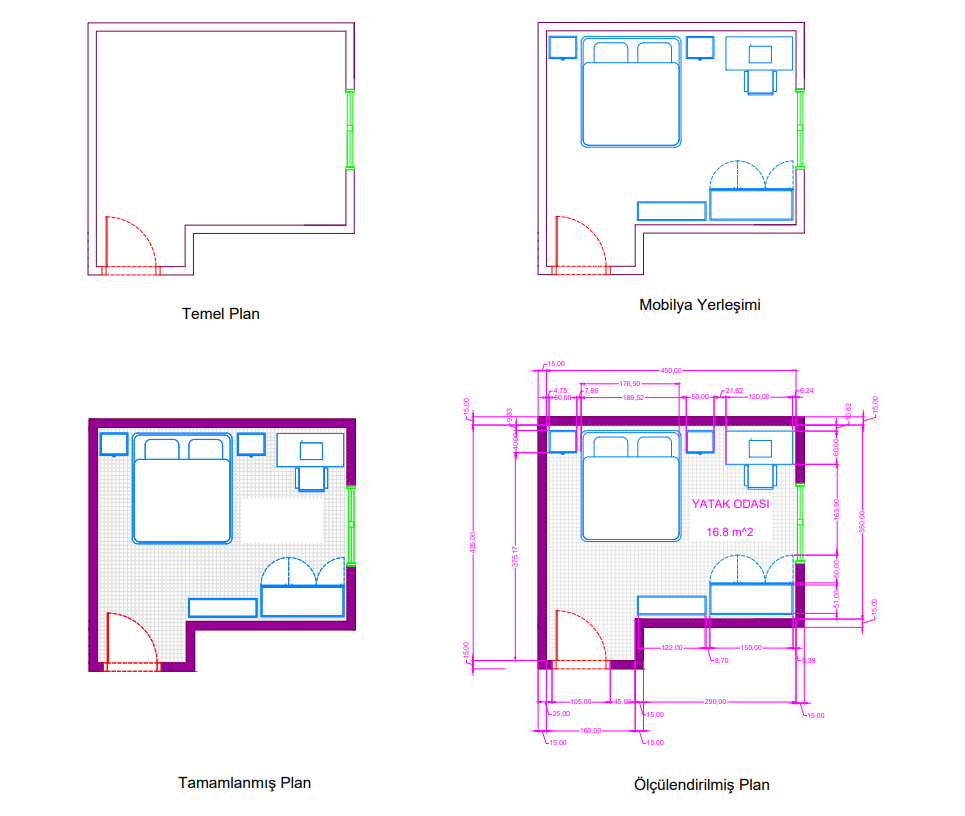

# 🛏️ Yatak Odası CAD Tasarımı

16.8 m² yatak odası için AutoCAD ile hazırlanmış mobilya yerleşim planı ve ölçülendirilmiş teknik çizim.

## 📐 Plan Görünümü

## 📁 Dosyalar

| Dosya | Açıklama |
|-------|----------|
| `BeyzaErdem_YatakOdasi.dwg` | AutoCAD çizim dosyası |
| `BeyzaErdem_YatakOdasi.bak` | AutoCAD yedek dosyası |
| `BeyzaErdem_YatakOdasi-Model.pdf` | Ölçülendirilmiş plan (PDF) |

## 🛠️ Kullanılan Araç
- **AutoCAD** — Teknik çizim ve plan

## 📐 Proje Detayları
- **Alan:** 16.8 m²
- **Oda Boyutları:** 450 cm x 350 cm
- Temel plan, mobilya yerleşimi, tamamlanmış plan ve ölçülendirilmiş plan

## 👩‍🎨 Geliştirici
**Beyza Erdem** — TNC Group Staj Projesi
